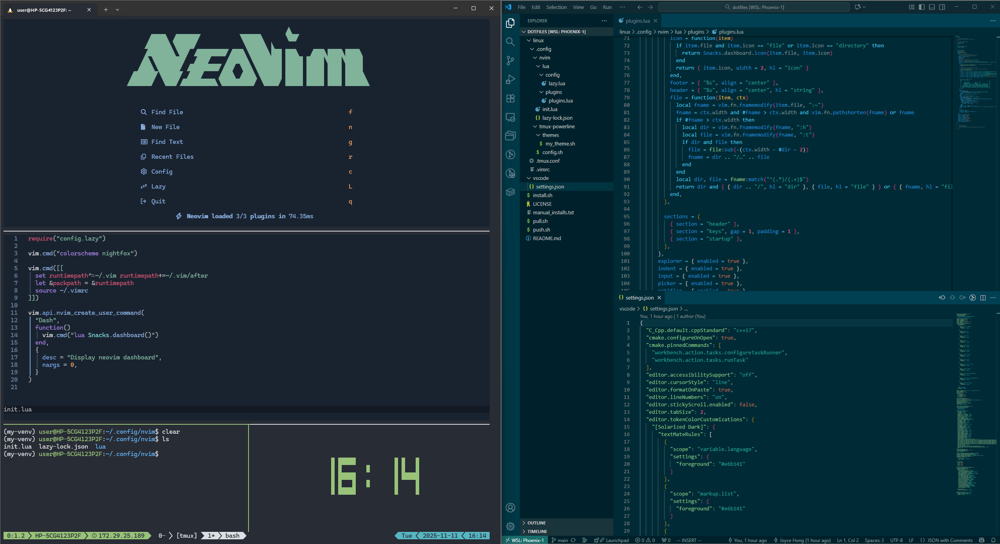

# Personal dotfiles collection

Configuration files for various dev things plus scripts for quick environment setup.

## Current contents:
### Tmux
- Mouse controls and fixed color display
- tmux-powerline theme

### Neovim
- Lazy.nvim plugin manager setup
- Startup dashboard configuration

### VS Code
- Custom Solarized Dark highlighting colors
- Modified vim extension keybindings

